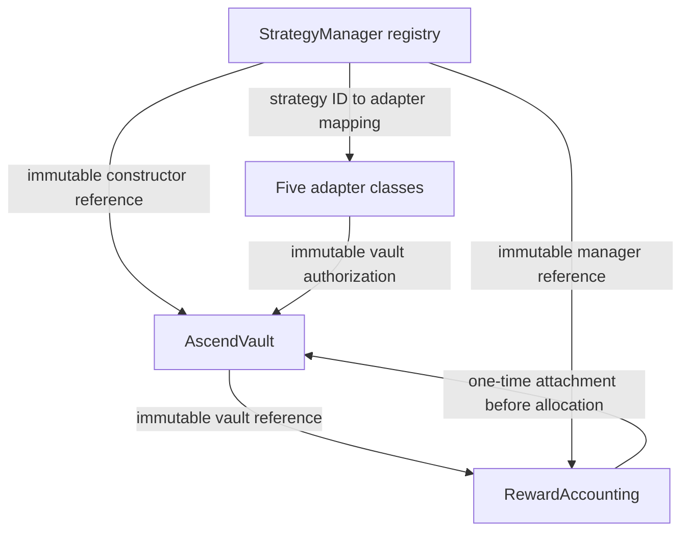

# Iteration 18 — deployment architecture and deployment-free preflight

Accepted baseline: `f8d309d2e8ca1904cbe31560a17591332ed7b80c`.
Canonical machine-readable **design**, not a deployment manifest:
[`data/intended_deployment_architecture.json`](../data/intended_deployment_architecture.json).
Read-only structural checks: [`tools/deployment_preflight.py`](../tools/deployment_preflight.py).

**The capstone evaluates a prototype implementation and optimizer architecture.
It does not require an actual public deployment of the vault/adapter stack.**
No public deployment is required or planned. Logical construction order below is
explanatory only, not a transaction-submission milestone. No wallet, key, public
transaction, admission capture or route discovery is introduced.

Two questions remain separate:

- **INTENDED_DEPLOYMENT_ARCHITECTURE:** what topology this implementation would
  have on the intended execution network if instantiated.
- **Deployment-free readiness:** source compilation, ABI/type alignment,
  parameter structure and local mock behavior that can be validated now.

No actual runtime binding is established by either. Iteration 17's bounded
NO_RECOVERABLE_CAPSTONE_DEPLOYMENT result remains unchanged. Its previously
recommended deployment-planning next branch is superseded by this explicit
project-scope decision; deployment is not a required later acceptance criterion.

## A. Core architecture

| Component | Role | Depends on | Source-fixed inputs/behavior | Deployment-time inputs | Current status |
|---|---|---|---|---|---|
| StrategyManager | Owner-controlled adapter registry; exposes strategy enumeration and hard limit configuration | Ownable2Step; IStrategyAdapter | StrategyConfig fields; BPS scale 10000; metadata/type/code checks | initialOwner; actual instance; per-strategy adapter/inputAsset/depositCap/maxAllocationBps/asynchronous/active | SOURCE_IMPLEMENTED; STATICALLY_VALIDATED; LOCAL_SIMULATION_VALIDATED; NOT_DEPLOYED |
| AscendVault | Per-user idle/shares/pending claims; user-authorized allocation and exits | Constructed StrategyManager; optional attached RewardAccounting | Native sentinel address(0); user authorization; pause, deadline/minimum, caps; allocation-start lock | initialOwner; strategyManager_ instance; later accounting instance | Same; public binding unresolved |
| RewardAccounting | Accumulative reward-per-share for separately claimable rewards only | Constructed AscendVault and same StrategyManager | ACC_PRECISION 1e18; maximum 8 reward tokens/strategy; onlyVault share sync/claim; owner/current registered adapter notification | initialOwner; vault_; strategyManager_; reward-token registration if applicable | Same; public binding unresolved |



The arrows describe references/relationships, not fund-flow chronology. Adapters
receive funds when the **user** invokes vault allocation; the optimizer has no
on-chain execution authority. No common admin address is selected: manager,
vault, accounting and Native adapter owners are distinct constructor roles,
although local tests reuse one test owner. Core admin transfers use Ownable2Step.
Gimo, V3 and AscendProtocolAdapter have vault authorization without an independent
Ownable admin in those implementations.

Source-grounded controls:

- Manager registration checks nonzero/nonempty-code adapter, nonzero bytes32 ID,
  duplicate IDs, inputAsset and asynchronous metadata agreement, and allocation
  bps <= 10000. Owner may change limits/activity/adapter; this is not an automatic
  optimizer decision or a proof of safe position migration.
- Vault supports an asset when an active registry route uses it. All five current
  paths use native `address(0)`. Generic approved ERC20 support is implemented,
  without making W0G a current separate optimizer input/strategy.
- `depositCap` bounds adapter `totalAssets() + amount`; it is not TVL-derived
  admission. `maxAllocationBps` bounds existing strategy value plus allocation
  against the actual `userAssetValue(user,inputAsset)` basis. That function
  includes idle + active strategy value and excludes pending claims until claimed.
  No policy limits are chosen or changed here.
- Vault owner pauses new deposits/allocations; strategy withdrawal/claim, idle
  withdrawal and reward claims remain available. Allocation checks deadline,
  minShares, user idle balance, active registry state and caps.
- Accounting attachment is optional in source. If used, attach it once before
  the first allocation; verify accounting.vault/strategyManager reciprocally.
  Vault checkpoints shares before changes and calls accounting.claimFor.
- Accounting owner registers reward tokens after the strategy exists. Owner or
  current registered adapter may notify actual separately claimable rewards.
  Share/rate-embedded Gimo/Ascend yield and LP NAV fees must not be notified again.
  Existing adapters do not automatically create a separately claimable stream.

## B. Five strategy architectures

| Strategy | Adapter | External dependencies | Deployment-time route inputs | Unresolved inputs | Gate/status |
|---|---|---|---|---|---|
| NATIVE_STAKE_0G | Native0GStakingAdapter | I0GValidator delegation/queue contract | initialOwner, vault_, validator_ | Actual owner/instances/validator; registry limits/activity | CONDITIONAL; validator UNRESOLVED_DEPLOYMENT_INPUT |
| GIMO_STAKE_0G | GimoAdapter | Gimo stakePool, st0G getRate/ERC20 | vault_, stakePool_, st0g_, referral_ | Capstone instances/referral and actual external binding; registry config | CONDITIONAL; external addresses are references |
| JAINE_LP_0G_USDC | JaineLPAdapter → V3LiquidityAdapter | Jaine factory/V1 router/NPM, W0G/USDC.e; off-chain V1 quoter | vault_, pool_, feeTier_, tickLower_/tickUpper_, sqrtLowerX96_/sqrtUpperX96_, targetUsdcBps_ | Actual instances/pool/token order/fee/spacing/ticks/sqrt/target/registration | CONDITIONAL; independent fixed V1 route design |
| OKU_LP_0G_USDC | OkuV3Adapter → V3LiquidityAdapter | Its Uniswap V3 factory/Router02/NPM, W0G/USDC.e; off-chain QuoterV2 | Same argument types, separate values | Its own actual instances/pool/order/fee/spacing/ticks/sqrt/target/registration | CONDITIONAL; independent fixed ROUTER02 design |
| ASCEND_STAKE_A0G | AscendProtocolAdapter | W0G, SourceCore/a0G shares, SourceCore WithdrawalQueue | vault_, sourceCore_, w0g_; queue is read/checked by constructor | Actual adapter/core/source/asset/queue binding and registration | CLOSED; static checks cannot open it |

Intended registration convention: `ethers.id(strategy_id)` (keccak256 UTF-8)
→ corresponding adapter → StrategyManager.StrategyConfig → vault user allocation.
The manager itself accepts any nonzero bytes32; this is the project test/design
convention, not proof that any key was publicly registered. Asynchronous modes
are true for Native/Gimo/Ascend and false for both LPs. Registry inputs are native
0G for these five. Caps/activity remain unspecified; no positive admission is
implied by registration topology.

Ascend's Python CLOSED gate is **not automatically encoded in Solidity**. Local
fixtures set registry active=true to exercise mechanics; that is not an admission
or gate-clearance decision. A hypothetical registration must not be used to bypass
the authoritative optimizer gate.

Paths:

- Native: native 0G → validator.delegate → validator shares → undelegate with
  explicit separately funded fee reserve → processWithdrawQueue/claim → vault
  idle. Anyone can fund reserve; only Native adapter owner can recover unused
  reserve. Sample validators cannot supply the constructor choice.
- Gimo: native 0G → stake(referral) → actual st0G → unstake/burn → delayed
  parameterless withdraw → vault idle. Adapter serializes one outstanding exit;
  getRate values shares. Referral is a constructor string (empty allowed), with
  no public setter in current source; mock referral is not canonical configuration.
- Jaine/Oku: native 0G → W0G → fixed target W0G/USDC.e composition → pooled NPM
  NFT/shares → decreaseLiquidity → collect actual inventory → swap actual USDC.e
  to W0G → unwrap → vault idle. The immutable target is supplied once, not
  recomputed per deposit. Venue router ABIs differ. Quoters are off-chain inputs,
  not constructor dependencies or admission proof.
- Ascend: native 0G → W0G → SourceCore.deposit → SourceCore ERC4626 a0G shares
  → requestWithdrawal → epoch funding/readiness → queue claim W0G → unwrap →
  vault idle. Queue/source/asset relationships are constructor checks. Same-epoch
  aggregate claims are settled once and distributed pro rata. a0G is not 1:1 0G.

All strategy settlements credit vault idle before a separate wallet withdrawal.
Ethereum (1) is the Ascend Mellow/Symbiotic/OFT backing/dependency domain, not an
independent allocation or user bridging route. It is not expanded into the
user-facing constructor/identity. Galileo (16602) is development/test only; Base
(8453) is KIV. Neither substitutes addresses into intended Mainnet 16661 routes.

## C. Route component classifications

Each canonical component row includes exact value/null, classification, chain,
meaning, pinned source path/commit/SHA256. The full address-level matrix follows
at the end of this specification. Common distinctions:

| Component | Classification | Interpretation |
|---|---|---|
| Adapter implementation class and router ABI mode | SOURCE_FIXED | Compile/source identity, not public instance |
| Pinned LP periphery/token addresses; Gimo/Ascend collector constants | EXTERNAL_PROTOCOL_REFERENCE | Intended Mainnet references; LP constants additionally source-fixed |
| Owner, core/adapter instance, Native validator, referral, pool/range/target/caps/activity | UNRESOLVED_DEPLOYMENT_INPUT | Null; no account, validator, pool, caps or range selected |
| Manager strategy key convention | DERIVED_CONFIGURATION | Formula recorded, actual registration null |
| Pool token0/token1/spacing; SourceCore queue | DERIVED_CONFIGURATION | Derived from a supplied actual context; currently null/unresolved |
| W0G economic role | AUXILIARY_NOT_STRATEGY | Execution representation of 0G family, not sixth strategy |
| Supplied hypothetical parameters | DEPLOYMENT_TIME_INPUT | Validatable in ephemeral SYNTHETIC_PREFLIGHT_ONLY tests; not persisted as actual runtime configuration |

The evidence contract stays strict: a static address, ABI, hash or local test does
not qualify a VERIFIED runtime identity. Neither this design dataset nor the
preflight result is a RuntimeConfigContext or admission-capture dataset.

## D. HYPOTHETICAL_DEPLOYMENT_ORDER

Documentation only; not a required plan and not to be executed for this capstone.

| Step | Contract/action | Dependency | Reason |
|---|---|---|---|
| 1 | StrategyManager(initialOwner) | Only unresolved owner role | No vault constructor dependency |
| 2 | AscendVault(initialOwner, manager) | Manager instance | Vault stores immutable manager |
| 3 | RewardAccounting(initialOwner, vault, manager), if included | Vault + same manager | Immutable reciprocal references |
| 4 | Vault.configureRewardAccounting(accounting), if included | Accounting + vault owner authorization | Must precede first allocation; one-time attachment |
| 5 | Five adapter constructors | Vault + each external/route input | onlyVault bindings; Native also owner/validator |
| 6 | Manager.registerStrategy for each intended ID | Adapter instance + owner authorization + matching metadata | Establish mapping/limits/activity without inferring optimizer admission |
| 7 | Register reward tokens only for supported separate reward streams, if any | Strategy registry + accounting owner | No duplication of rate/NAV-embedded return |
| 8 | User interaction model | Registry active route and user authorization | Deposit idle, then explicit allocation with bounds; not autonomous optimizer execution |

Steps 3–4 and 5–6 can be arranged independently where dependencies allow, but
accounting attachment must occur before first allocation if accounting is used.
No public script or key-handling path is created. Fee reserve funding is part of
Native's modelled withdrawal prerequisites, not current headroom evidence.

## E. Deployment-free preflight matrix

| Check | Evidence method | Result | Evidence class | Limitation |
|---|---|---|---|---|
| Contract compilation/interfaces | Existing Hardhat compiler 0.8.24, optimizer runs 200 | PASS: 45 Solidity files compiled; EVM target paris | STATICALLY_VALIDATED | No chain code presence, contract audit or actual deployment |
| Constructor type/name alignment | Eight compiled constructor ABI checks against canonical design | PASS | STATICALLY_VALIDATED | Does not fill unresolved arguments or prove external ABI availability |
| Registry/accounting/vault surfaces | Compiled StrategyConfig tuple and authorization method ABI checks | PASS | STATICALLY_VALIDATED | Runtime permission behavior tested separately |
| Core behavior | Existing manager/vault/accounting fixtures | PASS | LOCAL_SIMULATION | Mock chain only; current userAssetValue pending-claim limitation retained |
| Native/Gimo/Ascend flow | Existing individual adapter/core fixtures | PASS | LOCAL_SIMULATION | External protocols are mocks; no configured Mainnet route |
| Both V3 modes | Existing shared V3 adapter fixtures registered under independent Jaine/Oku IDs | PASS | LOCAL_SIMULATION | Concrete wrappers compiled/ABI-checked, not instantiated at external reference addresses |
| Partial canonical parameter/reference structure | Read-only tools/deployment_preflight.py | PASS | STATICALLY_VALIDATED | Null unresolved inputs are preserved, not called complete route validation |
| Supplied Native/Gimo structure | Nonzero address/type/string checks in explicit ephemeral fixtures | PASS | SYNTHETIC_PREFLIGHT_ONLY | No validator selection, code presence or stakePool/st0G authenticity |
| Supplied V3 structure | Pair/order, uint24 fee shape, positive int24 spacing, bounded/aligned ordered ticks, ordered uint160 sqrt bounds, target 1..9999, exact ABI mode | PASS | SYNTHETIC_PREFLIGHT_ONLY | No factory/pool state authentication, supported fee discovery or current admission |
| Supplied Ascend structure | SourceCore=a0G; asserted asset and queue reciprocal relationships | PASS | SYNTHETIC_PREFLIGHT_ONLY | Caller-supplied relationships, not on-chain reads |
| Chain/address roles | Design chain guards and frozen reference consistency | PASS | STATICALLY_VALIDATED / EXTERNAL_PROTOCOL_REFERENCE | Source attribution, not independent code/network verification |
| Actual registration/external binding | Unchanged canonical runtime config | UNRESOLVED | UNRESOLVED_RUNTIME_BINDING | No public identity/config promotion |
| Actual technical admission | Unchanged headers-only admission CSV | UNAVAILABLE; UNKNOWN | MISSING | No TVL/quote/NAV fallback |

The parameter validator checks **structural** sqrt ordering/width, not mathematical
consistency between supplied sqrt values and ticks. Exact TickMath bound
consistency and authentic pool/periphery state cannot be claimed from this check.
Existing V3 mocks use simplified sqrt/range/price mechanics. Both limitations are
explicit rather than mislabelled as registered-range/market validation.

No new deploy/dry-run script exists. The Python tool only reads files and returns
static design diagnostics. New Hardhat tests only read compiled artifacts and
require the in-process `hardhat` network/31337. Existing fixture transactions run
locally with Hardhat's test accounts; no wallet/key is created or stored for the
project and no public transaction is sent.

## F. Readiness dimensions

| Strategy | Source implemented | Static validation | Local simulation | External dependencies known | Runtime binding | Public deployment |
|---|---|---|---|---|---|---|
| Native | SOURCE_IMPLEMENTED | STATICALLY_VALIDATED | LOCAL_SIMULATION_VALIDATED | Validator interface known; actual validator unresolved | RUNTIME_BINDING_UNRESOLVED | NOT_PERFORMED |
| Gimo | SOURCE_IMPLEMENTED | STATICALLY_VALIDATED | LOCAL_SIMULATION_VALIDATED | EXTERNAL_DEPENDENCY_REFERENCED | RUNTIME_BINDING_UNRESOLVED | NOT_PERFORMED |
| Jaine | SOURCE_IMPLEMENTED | STATICALLY_VALIDATED | LOCAL_SIMULATION_VALIDATED, V1 base adapter only | EXTERNAL_DEPENDENCY_REFERENCED; actual pool/range unresolved | RUNTIME_BINDING_UNRESOLVED | NOT_PERFORMED |
| Oku | SOURCE_IMPLEMENTED | STATICALLY_VALIDATED | LOCAL_SIMULATION_VALIDATED, Router02 base adapter only | EXTERNAL_DEPENDENCY_REFERENCED; own pool/range unresolved | RUNTIME_BINDING_UNRESOLVED | NOT_PERFORMED |
| Ascend | SOURCE_IMPLEMENTED | STATICALLY_VALIDATED | LOCAL_SIMULATION_VALIDATED | EXTERNAL_DEPENDENCY_REFERENCED; actual queue binding unresolved | RUNTIME_BINDING_UNRESOLVED; gate CLOSED | NOT_PERFORMED |

Compilation and local simulation do not imply execution-ready or production-ready.
README phrases “live execution,” “verified periphery” and planner/deployed
alignment are not relied on as deployment-readiness proof. The new scope boundary
supersedes those interpretations without broadly rewriting README or proposal.

## G. Remaining deployment-independent completion work

No item below requires deploying contracts, filling a verified runtime identity,
or making a positive production-style allocation.

| Area | Completion need |
|---|---|
| Data/economics | Qualify available observational rates/return histories and incentive realization; keep assumed/demo inputs explicit, including unresolved Native fee basis |
| Execution/freshness | Address LP quote provenance/config/amount/age limits if claiming qualified current execution; otherwise label synthetic/unbound quotes and restrict claims |
| Cost provenance | Distinguish missing, observed, quote-derived, modelled and structural-zero costs for evaluation; do not fabricate measurements |
| Stress | Complete registered/synthetic-position benchmark and deterministic scenario semantics at the claimed evidence level; avoid causal/double-counting claims without linkage |
| Portfolio scope | Retain decision-sleeve claims unless existing-state/funding/pending-claim accounting is actually implemented; whole-portfolio acquisition is an optional extension, not deployment dependency |
| Dashboard/output | Migrate rendering to authoritative multidimensional state, zero/exclusion reasons, scope/readiness/proof/freshness semantics |
| Evaluation | Reproducible synthetic/modelled experiments, legacy-vs-amount-aware comparison, sensitivity and failure cases with explicit evidence limitations; observational protocol data can be reported separately |
| Documentation/proposal | Reconcile stale execution/alignment wording, architecture/measurement/solver claims and no-public-deployment project boundary in a later authorized task |

Runtime config may legitimately remain UNRESOLVED; production-style admission may
remain unavailable; repository-only amount-aware runs may legitimately remain
100% idle through capstone completion. Iterations 14–16 exact decimals, verified
config boundary, admission matching/freshness and selected-point revalidation
remain intact. Only explicit test/demo overrides may support synthetic scenarios;
they cannot create live proof or bypass Ascend CLOSED.

## Validation record

Validation completed:

| Command/check | Result |
|---|---|
| `npm run contracts:compile` | 45 Solidity files compiled successfully, solc 0.8.24 / paris / optimizer 200 |
| Existing full Hardhat suite before additions | 63 passed |
| `npx hardhat test test-contracts/DeploymentPreflight.test.js --network hardhat` | 9 new ABI/preflight tests passed |
| `npm run contracts:test` after additions | 72 passed; complete suite |
| `python -m pytest -q tests/test_deployment_preflight.py` | 62 focused structural/policy tests passed |
| `python -m pytest -q` | 416 passed; one existing Gimo pandas FutureWarning |
| `python tools/deployment_preflight.py` | Static design checks passed; UNRESOLVED_RUNTIME_BINDING / NOT_DEPLOYED |
| `python tools/audit_deployment_history.py --check` | Frozen source/runtime/admission hashes and historical audit replay passed |
| `git diff --check` | Passed |
| API/frontend checks | Not run; runtime/API/TypeScript/frontend contracts untouched |

Reproduce after installing the existing pinned dependencies:

```bash
npm install --no-package-lock
npm run contracts:compile
npm run contracts:test
python -m pip install -r requirements.txt
python tools/deployment_preflight.py
python -m pytest -q tests/test_deployment_preflight.py
python -m pytest -q
python -m src.ascend_optimizer.amount_demo --as-of 2026-10-09T14:00:00Z
git diff --check
```

Repository-only amount-aware baseline at that fixed time: Conservative,
Balanced and Aggressive all select no positive route and retain **100% idle**.
Admission/configuration are repository-only; valuation/return inputs in this demo
remain synthetic assumptions. The full Python suite preserves legacy results,
exact decimal matching, admission freshness, config guards and revalidation.

**The architecture is deployment-ready at the prototype/design-validation level,
but no public capstone deployment has been performed or is required for project
completion.** Here that phrase means compile/ABI/structural/local-test readiness;
it does not mean transaction-complete configuration, authenticated external
runtime bindings, production safety or execution-ready routes.
The canonical design contains no actual adapter/core deployment addresses, chosen
validator/pool/range, synthetic positive captures or public deployment claims.

## Full canonical route component matrix

| Strategy | Component | Value | Classification | Evidence source |
|---|---|---|---|---|
| NATIVE_STAKE_0G | adapter_address | null / unresolved | UNRESOLVED_DEPLOYMENT_INPUT | contracts/adapters/Native0GStakingAdapter.sol |
| NATIVE_STAKE_0G | vault_address | null / unresolved | UNRESOLVED_DEPLOYMENT_INPUT | contracts/adapters/Native0GStakingAdapter.sol |
| NATIVE_STAKE_0G | strategy_manager_address | null / unresolved | UNRESOLVED_DEPLOYMENT_INPUT | contracts/adapters/Native0GStakingAdapter.sol |
| NATIVE_STAKE_0G | manager_strategy_key | null / unresolved; ethers.id(strategy_id); manager accepts any nonzero bytes32 | DERIVED_CONFIGURATION | contracts/adapters/Native0GStakingAdapter.sol |
| NATIVE_STAKE_0G | adapter_class | Native0GStakingAdapter | SOURCE_FIXED | contracts/adapters/Native0GStakingAdapter.sol |
| NATIVE_STAKE_0G | validator | null / unresolved | UNRESOLVED_DEPLOYMENT_INPUT | contracts/adapters/Native0GStakingAdapter.sol |
| NATIVE_STAKE_0G | initial_owner | null / unresolved | UNRESOLVED_DEPLOYMENT_INPUT | contracts/adapters/Native0GStakingAdapter.sol |
| NATIVE_STAKE_0G | input_asset | 0x0000000000000000000000000000000000000000 | SOURCE_FIXED | contracts/adapters/Native0GStakingAdapter.sol |
| NATIVE_STAKE_0G | asynchronous | True | SOURCE_FIXED | contracts/adapters/Native0GStakingAdapter.sol |
| NATIVE_STAKE_0G | deposit_cap | null / unresolved | UNRESOLVED_DEPLOYMENT_INPUT | contracts/StrategyManager.sol |
| NATIVE_STAKE_0G | max_allocation_bps | null / unresolved | UNRESOLVED_DEPLOYMENT_INPUT | contracts/StrategyManager.sol |
| NATIVE_STAKE_0G | active | null / unresolved | UNRESOLVED_DEPLOYMENT_INPUT | contracts/StrategyManager.sol |
| GIMO_STAKE_0G | adapter_address | null / unresolved | UNRESOLVED_DEPLOYMENT_INPUT | contracts/adapters/GimoAdapter.sol |
| GIMO_STAKE_0G | vault_address | null / unresolved | UNRESOLVED_DEPLOYMENT_INPUT | contracts/adapters/GimoAdapter.sol |
| GIMO_STAKE_0G | strategy_manager_address | null / unresolved | UNRESOLVED_DEPLOYMENT_INPUT | contracts/adapters/GimoAdapter.sol |
| GIMO_STAKE_0G | manager_strategy_key | null / unresolved; ethers.id(strategy_id); manager accepts any nonzero bytes32 | DERIVED_CONFIGURATION | contracts/adapters/GimoAdapter.sol |
| GIMO_STAKE_0G | adapter_class | GimoAdapter | SOURCE_FIXED | contracts/adapters/GimoAdapter.sol |
| GIMO_STAKE_0G | stake_pool | 0xAc06d1Df23a4Fa00981aFAC0f33A5936Bd2135aF | EXTERNAL_PROTOCOL_REFERENCE | src/ascend_optimizer/collectors/gimo.py |
| GIMO_STAKE_0G | st0g | 0x7bBC63D01CA42491c3E084C941c3E86e55951404 | EXTERNAL_PROTOCOL_REFERENCE | src/ascend_optimizer/collectors/gimo.py |
| GIMO_STAKE_0G | withdrawal_contract | 0xAc06d1Df23a4Fa00981aFAC0f33A5936Bd2135aF | EXTERNAL_PROTOCOL_REFERENCE | src/ascend_optimizer/collectors/gimo.py |
| GIMO_STAKE_0G | referral | null / unresolved | UNRESOLVED_DEPLOYMENT_INPUT | contracts/adapters/GimoAdapter.sol |
| GIMO_STAKE_0G | input_asset | 0x0000000000000000000000000000000000000000 | SOURCE_FIXED | contracts/adapters/GimoAdapter.sol |
| GIMO_STAKE_0G | asynchronous | True | SOURCE_FIXED | contracts/adapters/GimoAdapter.sol |
| GIMO_STAKE_0G | deposit_cap | null / unresolved | UNRESOLVED_DEPLOYMENT_INPUT | contracts/StrategyManager.sol |
| GIMO_STAKE_0G | max_allocation_bps | null / unresolved | UNRESOLVED_DEPLOYMENT_INPUT | contracts/StrategyManager.sol |
| GIMO_STAKE_0G | active | null / unresolved | UNRESOLVED_DEPLOYMENT_INPUT | contracts/StrategyManager.sol |
| JAINE_LP_0G_USDC | adapter_address | null / unresolved | UNRESOLVED_DEPLOYMENT_INPUT | contracts/adapters/JaineLPAdapter.sol |
| JAINE_LP_0G_USDC | vault_address | null / unresolved | UNRESOLVED_DEPLOYMENT_INPUT | contracts/adapters/JaineLPAdapter.sol |
| JAINE_LP_0G_USDC | strategy_manager_address | null / unresolved | UNRESOLVED_DEPLOYMENT_INPUT | contracts/adapters/JaineLPAdapter.sol |
| JAINE_LP_0G_USDC | manager_strategy_key | null / unresolved; ethers.id(strategy_id); manager accepts any nonzero bytes32 | DERIVED_CONFIGURATION | contracts/adapters/JaineLPAdapter.sol |
| JAINE_LP_0G_USDC | adapter_class | JaineLPAdapter | SOURCE_FIXED | contracts/adapters/JaineLPAdapter.sol |
| JAINE_LP_0G_USDC | factory | 0x9bdcA5798E52e592A08e3b34d3F18EeF76Af7ef4 | EXTERNAL_PROTOCOL_REFERENCE | contracts/adapters/JaineLPAdapter.sol |
| JAINE_LP_0G_USDC | router | 0x8B598A7C136215A95ba0282b4d832B9f9801f2e2 | EXTERNAL_PROTOCOL_REFERENCE | contracts/adapters/JaineLPAdapter.sol |
| JAINE_LP_0G_USDC | position_manager | 0x8F67A30Ed186e3E1f6504c6dE3239Ef43A2e0d72 | EXTERNAL_PROTOCOL_REFERENCE | contracts/adapters/JaineLPAdapter.sol |
| JAINE_LP_0G_USDC | pool | null / unresolved | UNRESOLVED_DEPLOYMENT_INPUT | contracts/adapters/JaineLPAdapter.sol |
| JAINE_LP_0G_USDC | w0g | 0x1Cd0690fF9a693f5EF2dD976660a8dAFc81A109c | EXTERNAL_PROTOCOL_REFERENCE | contracts/adapters/JaineLPAdapter.sol |
| JAINE_LP_0G_USDC | usdce | 0x1f3AA82227281cA364bFb3d253B0f1af1Da6473E | EXTERNAL_PROTOCOL_REFERENCE | contracts/adapters/JaineLPAdapter.sol |
| JAINE_LP_0G_USDC | token0 | null / unresolved; pool.token0() | DERIVED_CONFIGURATION | contracts/adapters/JaineLPAdapter.sol |
| JAINE_LP_0G_USDC | token1 | null / unresolved; pool.token1() | DERIVED_CONFIGURATION | contracts/adapters/JaineLPAdapter.sol |
| JAINE_LP_0G_USDC | fee_tier | null / unresolved | UNRESOLVED_DEPLOYMENT_INPUT | contracts/adapters/JaineLPAdapter.sol |
| JAINE_LP_0G_USDC | tick_spacing | null / unresolved; pool.tickSpacing() | DERIVED_CONFIGURATION | contracts/adapters/JaineLPAdapter.sol |
| JAINE_LP_0G_USDC | tick_lower | null / unresolved | UNRESOLVED_DEPLOYMENT_INPUT | contracts/adapters/JaineLPAdapter.sol |
| JAINE_LP_0G_USDC | tick_upper | null / unresolved | UNRESOLVED_DEPLOYMENT_INPUT | contracts/adapters/JaineLPAdapter.sol |
| JAINE_LP_0G_USDC | sqrt_lower_x96 | null / unresolved | UNRESOLVED_DEPLOYMENT_INPUT | contracts/adapters/JaineLPAdapter.sol |
| JAINE_LP_0G_USDC | sqrt_upper_x96 | null / unresolved | UNRESOLVED_DEPLOYMENT_INPUT | contracts/adapters/JaineLPAdapter.sol |
| JAINE_LP_0G_USDC | target_usdc_bps | null / unresolved | UNRESOLVED_DEPLOYMENT_INPUT | contracts/adapters/JaineLPAdapter.sol |
| JAINE_LP_0G_USDC | router_mode | V1 | SOURCE_FIXED | contracts/adapters/JaineLPAdapter.sol |
| JAINE_LP_0G_USDC | input_asset | 0x0000000000000000000000000000000000000000 | SOURCE_FIXED | contracts/adapters/JaineLPAdapter.sol |
| JAINE_LP_0G_USDC | asynchronous | False | SOURCE_FIXED | contracts/adapters/JaineLPAdapter.sol |
| JAINE_LP_0G_USDC | deposit_cap | null / unresolved | UNRESOLVED_DEPLOYMENT_INPUT | contracts/StrategyManager.sol |
| JAINE_LP_0G_USDC | max_allocation_bps | null / unresolved | UNRESOLVED_DEPLOYMENT_INPUT | contracts/StrategyManager.sol |
| JAINE_LP_0G_USDC | active | null / unresolved | UNRESOLVED_DEPLOYMENT_INPUT | contracts/StrategyManager.sol |
| JAINE_LP_0G_USDC | quoter | 0xd00883722cECAD3A1c60bCA611f09e1851a0bE02 | EXTERNAL_PROTOCOL_REFERENCE | src/ascend_optimizer/lp_execution.py |
| OKU_LP_0G_USDC | adapter_address | null / unresolved | UNRESOLVED_DEPLOYMENT_INPUT | contracts/adapters/OkuV3Adapter.sol |
| OKU_LP_0G_USDC | vault_address | null / unresolved | UNRESOLVED_DEPLOYMENT_INPUT | contracts/adapters/OkuV3Adapter.sol |
| OKU_LP_0G_USDC | strategy_manager_address | null / unresolved | UNRESOLVED_DEPLOYMENT_INPUT | contracts/adapters/OkuV3Adapter.sol |
| OKU_LP_0G_USDC | manager_strategy_key | null / unresolved; ethers.id(strategy_id); manager accepts any nonzero bytes32 | DERIVED_CONFIGURATION | contracts/adapters/OkuV3Adapter.sol |
| OKU_LP_0G_USDC | adapter_class | OkuV3Adapter | SOURCE_FIXED | contracts/adapters/OkuV3Adapter.sol |
| OKU_LP_0G_USDC | factory | 0xcb2436774C3e191c85056d248EF4260ce5f27A9D | EXTERNAL_PROTOCOL_REFERENCE | contracts/adapters/OkuV3Adapter.sol |
| OKU_LP_0G_USDC | router | 0x807F4E281B7A3B324825C64ca53c69F0b418dE40 | EXTERNAL_PROTOCOL_REFERENCE | contracts/adapters/OkuV3Adapter.sol |
| OKU_LP_0G_USDC | position_manager | 0x743E03cceB4af2efA3CC76838f6E8B50B63F184c | EXTERNAL_PROTOCOL_REFERENCE | contracts/adapters/OkuV3Adapter.sol |
| OKU_LP_0G_USDC | pool | null / unresolved | UNRESOLVED_DEPLOYMENT_INPUT | contracts/adapters/OkuV3Adapter.sol |
| OKU_LP_0G_USDC | w0g | 0x1Cd0690fF9a693f5EF2dD976660a8dAFc81A109c | EXTERNAL_PROTOCOL_REFERENCE | contracts/adapters/OkuV3Adapter.sol |
| OKU_LP_0G_USDC | usdce | 0x1f3AA82227281cA364bFb3d253B0f1af1Da6473E | EXTERNAL_PROTOCOL_REFERENCE | contracts/adapters/OkuV3Adapter.sol |
| OKU_LP_0G_USDC | token0 | null / unresolved; pool.token0() | DERIVED_CONFIGURATION | contracts/adapters/OkuV3Adapter.sol |
| OKU_LP_0G_USDC | token1 | null / unresolved; pool.token1() | DERIVED_CONFIGURATION | contracts/adapters/OkuV3Adapter.sol |
| OKU_LP_0G_USDC | fee_tier | null / unresolved | UNRESOLVED_DEPLOYMENT_INPUT | contracts/adapters/OkuV3Adapter.sol |
| OKU_LP_0G_USDC | tick_spacing | null / unresolved; pool.tickSpacing() | DERIVED_CONFIGURATION | contracts/adapters/OkuV3Adapter.sol |
| OKU_LP_0G_USDC | tick_lower | null / unresolved | UNRESOLVED_DEPLOYMENT_INPUT | contracts/adapters/OkuV3Adapter.sol |
| OKU_LP_0G_USDC | tick_upper | null / unresolved | UNRESOLVED_DEPLOYMENT_INPUT | contracts/adapters/OkuV3Adapter.sol |
| OKU_LP_0G_USDC | sqrt_lower_x96 | null / unresolved | UNRESOLVED_DEPLOYMENT_INPUT | contracts/adapters/OkuV3Adapter.sol |
| OKU_LP_0G_USDC | sqrt_upper_x96 | null / unresolved | UNRESOLVED_DEPLOYMENT_INPUT | contracts/adapters/OkuV3Adapter.sol |
| OKU_LP_0G_USDC | target_usdc_bps | null / unresolved | UNRESOLVED_DEPLOYMENT_INPUT | contracts/adapters/OkuV3Adapter.sol |
| OKU_LP_0G_USDC | router_mode | ROUTER02 | SOURCE_FIXED | contracts/adapters/OkuV3Adapter.sol |
| OKU_LP_0G_USDC | input_asset | 0x0000000000000000000000000000000000000000 | SOURCE_FIXED | contracts/adapters/OkuV3Adapter.sol |
| OKU_LP_0G_USDC | asynchronous | False | SOURCE_FIXED | contracts/adapters/OkuV3Adapter.sol |
| OKU_LP_0G_USDC | deposit_cap | null / unresolved | UNRESOLVED_DEPLOYMENT_INPUT | contracts/StrategyManager.sol |
| OKU_LP_0G_USDC | max_allocation_bps | null / unresolved | UNRESOLVED_DEPLOYMENT_INPUT | contracts/StrategyManager.sol |
| OKU_LP_0G_USDC | active | null / unresolved | UNRESOLVED_DEPLOYMENT_INPUT | contracts/StrategyManager.sol |
| OKU_LP_0G_USDC | quoter | 0xaa52bB8110fE38D0d2d2AF0B85C3A3eE622CA455 | EXTERNAL_PROTOCOL_REFERENCE | src/ascend_optimizer/lp_execution.py |
| ASCEND_STAKE_A0G | adapter_address | null / unresolved | UNRESOLVED_DEPLOYMENT_INPUT | contracts/adapters/AscendProtocolAdapter.sol |
| ASCEND_STAKE_A0G | vault_address | null / unresolved | UNRESOLVED_DEPLOYMENT_INPUT | contracts/adapters/AscendProtocolAdapter.sol |
| ASCEND_STAKE_A0G | strategy_manager_address | null / unresolved | UNRESOLVED_DEPLOYMENT_INPUT | contracts/adapters/AscendProtocolAdapter.sol |
| ASCEND_STAKE_A0G | manager_strategy_key | null / unresolved; ethers.id(strategy_id); manager accepts any nonzero bytes32 | DERIVED_CONFIGURATION | contracts/adapters/AscendProtocolAdapter.sol |
| ASCEND_STAKE_A0G | adapter_class | AscendProtocolAdapter | SOURCE_FIXED | contracts/adapters/AscendProtocolAdapter.sol |
| ASCEND_STAKE_A0G | w0g | 0x1Cd0690fF9a693f5EF2dD976660a8dAFc81A109c | EXTERNAL_PROTOCOL_REFERENCE | src/ascend_optimizer/collectors/ascend.py |
| ASCEND_STAKE_A0G | source_core | 0x4B3c2f55fa67679b382c979A082Df1B32079B4cB | EXTERNAL_PROTOCOL_REFERENCE | src/ascend_optimizer/collectors/ascend.py |
| ASCEND_STAKE_A0G | a0g | 0x4B3c2f55fa67679b382c979A082Df1B32079B4cB | EXTERNAL_PROTOCOL_REFERENCE | src/ascend_optimizer/collectors/ascend.py |
| ASCEND_STAKE_A0G | withdrawal_queue | null / unresolved; SourceCore.withdrawalQueue() | DERIVED_CONFIGURATION | contracts/adapters/AscendProtocolAdapter.sol |
| ASCEND_STAKE_A0G | input_asset | 0x0000000000000000000000000000000000000000 | SOURCE_FIXED | contracts/adapters/AscendProtocolAdapter.sol |
| ASCEND_STAKE_A0G | asynchronous | True | SOURCE_FIXED | contracts/adapters/AscendProtocolAdapter.sol |
| ASCEND_STAKE_A0G | deposit_cap | null / unresolved | UNRESOLVED_DEPLOYMENT_INPUT | contracts/StrategyManager.sol |
| ASCEND_STAKE_A0G | max_allocation_bps | null / unresolved | UNRESOLVED_DEPLOYMENT_INPUT | contracts/StrategyManager.sol |
| ASCEND_STAKE_A0G | active | null / unresolved | UNRESOLVED_DEPLOYMENT_INPUT | contracts/StrategyManager.sol |
